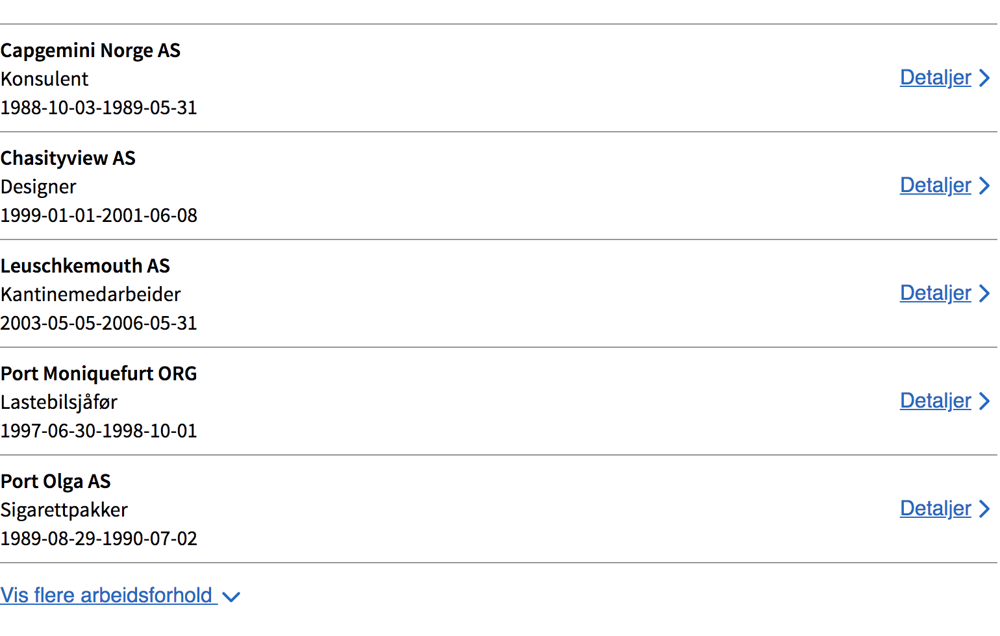
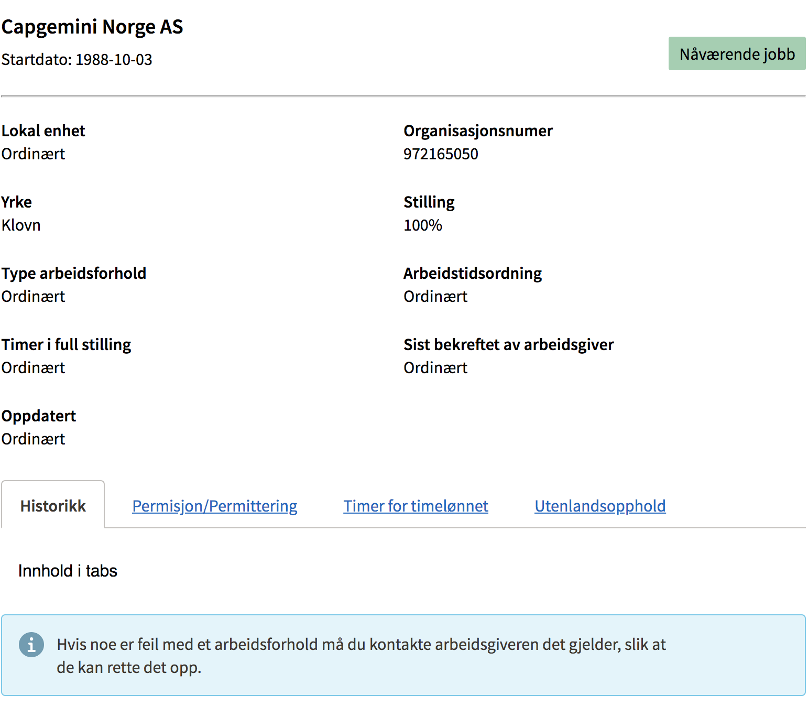

# NAV Arbeidsforhold

React moduler / mikro-frontends som viser brukerens arbeidsforhold

## Installasjon

```
npm install @navikt/arbeidsforhold
```

## Komponenter


Prosjektet er delt opp i uavhengige moduler som kan importeres

#### Liste med arbeidsforhold

```js
import { ListeMedArbeidsforhold } from "@navikt/arbeidsforhold";
```

Screenshot 



Eksempel

```js
onClick = (arbeidsforoldId: string) => console.log(arbeidsforholdId);
render = () => {
  return <ListeMedArbeidsforhold onClick={onClick} />;
};
```

#### Detaljert arbeidsforhold

```js
import { DetaljertArbeidsforhold } from "@navikt/arbeidsforhold";
```

Screenshot




Eksempel

```js
render = () => {
  const arbeidsforholdId = "konvertert_af709505-128e-45dc-a241-7e14180f787d";
  return <DetaljertArbeidsforhold arbeidsforholdId={arbeidsforholdId} />;
};
```

## Videreutvikling / test

Hent repoet fra github og installer NPM pakker

```
npm install
```

Start kompileringen av komponenten

```
npm start
```

Start test applikasjonen <br>
En simpel create-react-app som importerer og benytter pakkene

```
cd example && npm start
```

Prosjektet støtter hot-reloading, endringer i komponentene vil føre til at test-applikasjonen oppdateres

##Logging

Vi bruker fo-frontendlogger for logging. For oppslag i kibana:

```
application:frontendlogger AND x_appname:arbeidsforhold
```

# Henvendelser

Spørsmål knyttet til koden eller prosjektet kan rettes mot https://github.com/orgs/navikt/teams/team-personbruker

## For NAV-ansatte

Interne henvendelser kan sendes via Slack i kanalen #team-personbruker.
